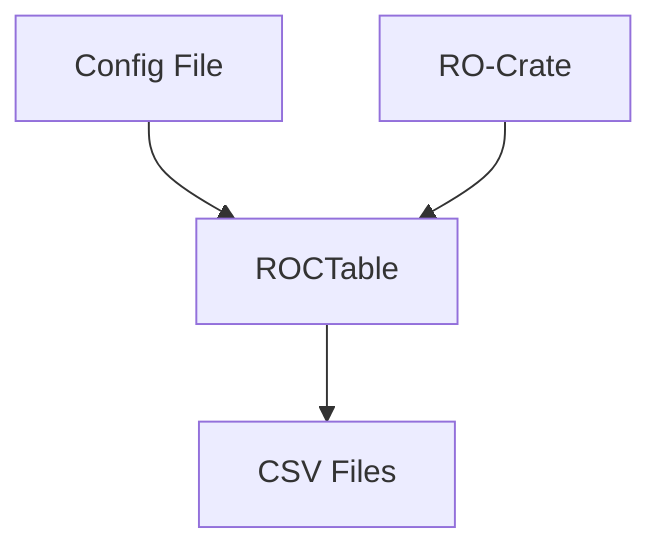
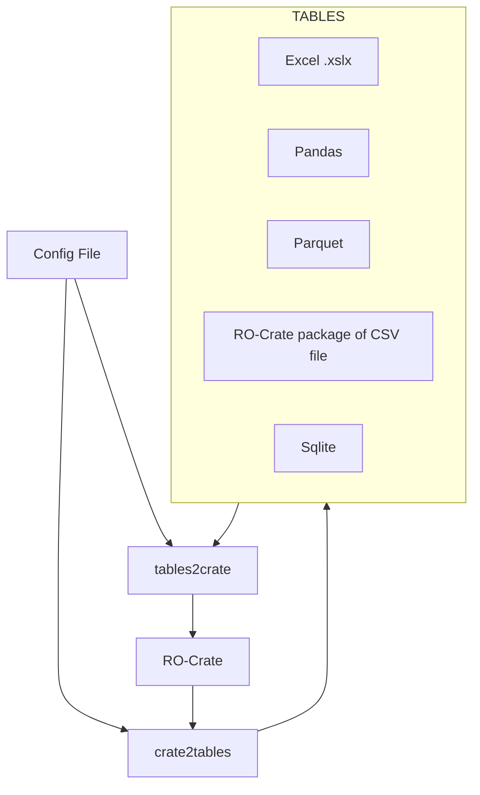

# roctable

This is an experimental project (for now) which was aimed at making a quick RO-Crate to table conversion like we do in [RO-Crate-Tabular](https://github.com/Sydney-Informatics-Hub/rocrate-tabular) - but more directly

This MAY become a general purpose javascript too for converting RO-Crates to and from  tabular formats INCLUDING multi-worksheet Excel, CSV, and sqlite

WARNING: This is not for production use - it's a sketch to try out a general approach to tabulation.

The flow in the is example is as follows:


Future potential.

This idea may be further developed into a general purpose tool for working with RO-Crate data entry using spreadsheets and export, replacing  [ro-crate-excel](https://github.com/Language-Research-Technology/ro-crate-excel) and tabulator for javascript users.




## Install and prepare
```
npm install .

```

## Try it on the COOEE dataset:

```
node index.js test_data/cooee -c cooee-config.json
```

