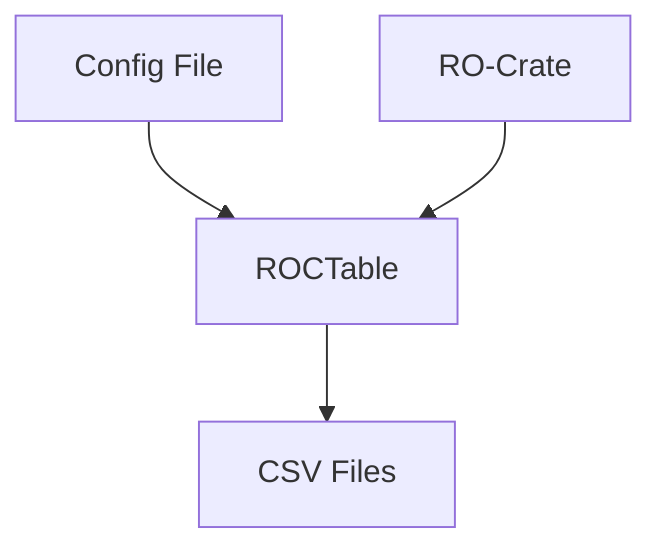
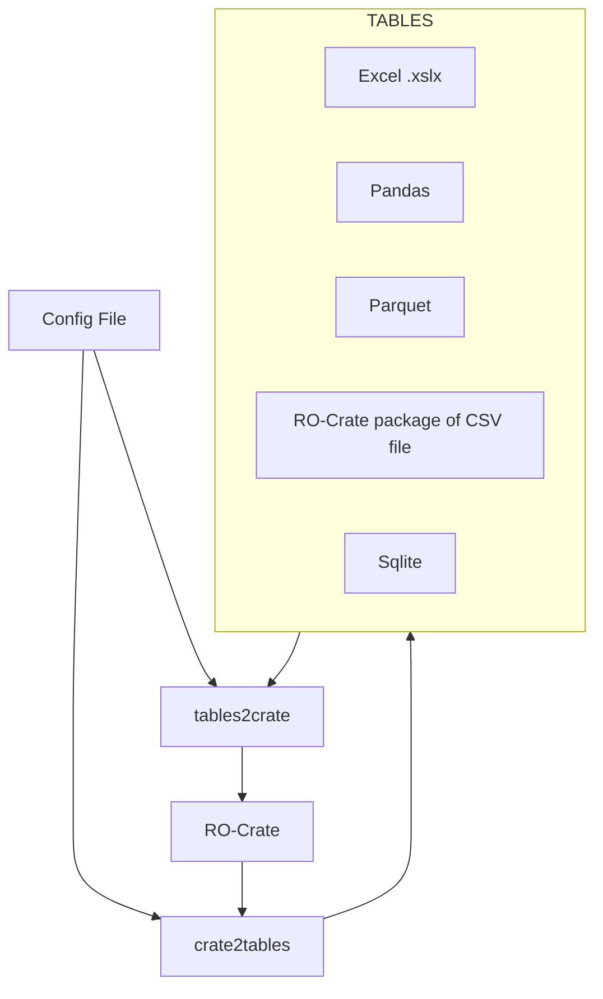

# Roctable

This is a work-in-progress general-purpose library for converting between RO-Crate and tabular formats, it will become a general purpose javascript tool for converting RO-Crates to and from  tabular formats multi-worksheet Excel, CSV, and sqlite, replacing  [ro-crate-excel](https://github.com/Language-Research-Technology/ro-crate-excel) and providing an alternative to the Python-language tabulator for javascript users.


This inital release converts crates to CSV files according to a configuration file:


```mermaid
graph TD;
    C["Config File"] --> TL["ROCTable"]
    R["RO-Crate"]-->TL;
    TL-->CSV["CSV Files"];
```   



```mermaid
graph TD;
    R["RO-Crate"] --> TS["crate2tables"]
    TS --> TABLES
    C--> TS
    subgraph TABLES
      X["Excel .xslx"]
      Pandas
      Parquet
      CSV["RO-Crate package of CSV file"]
      Sqlite
    end
    TABLES --> TR["tables2crate"]
    TR --> R
    C["Config File"] --> TR

```   

See [SPEC.md](SPEC.md) for the requirements this tool is being built against.

## Install and prepare
```
git submodule update --init
npm install
```

## Usage

Inspect a crate to discover its `@type`s and properties, writing (or updating) a config:
```
npx roctable inspect <crate-dir> -c <config.json>
```
Edit the config: move a type from `potential_tables` to `tables`, and set `include: true`
(and `expand`/`rename`/`load_text` as needed) on the properties you want in the output.
Then export CSV:
```
npx roctable csv <crate-dir> -c <config.json> -o <output-dir>
```

## Try it 


### On the COOEE dataset:

Download the data and unpack it into `./cooee`:

```
npm run download:cooee
```

Then export CSV using the example config:

```
npx roctable csv cooee -c examples/cooee-config.json -o output
```


### On the Farms to Freeways dataset

Download the data and unpack it into `./f2f` (this is a ~1.6GB zip, so this takes a while):

```
npm run download:f2f
```

This crate is a good exercise for the `load_text`/`join` mechanism in
[SPEC.md](SPEC.md) §5: several `RepositoryObject` interview entities have a
`ldac:mainText` property pointing at a CSV transcript (columns like `time`,
`speaker`, `text`), rather than plain text. `examples/f2f-config.json`
already ships with this set up, but to see how you'd configure it yourself,
inspect the crate against that config:

```
npx roctable inspect f2f -c examples/f2f-config.json
```

then set on that property:

```json
"ldac:mainText": {
  "include": true,
  "load_text": true,
  "join": "csv"
}
```

and export as usual — each interview's single row is replaced by one row per
line of its transcript, with the interview's own columns (speaker, name, ...)
repeated on every line and the transcript's own columns added as
`_joined_time`, `_joined_speaker`, `_joined_text`, etc.

```
npx roctable csv f2f -c examples/f2f-config.json -o output
```

Note: in this particular dataset the `speaker` column just holds a
turn-taking code (`A`/`B`), not an @id, so it isn't a useful example of the
`expand` option below — see the join-expand demo instead.

### Join-expand demo (no download required)

`examples/join-expand-crate` is a tiny, self-contained crate for exercising
the case where a joined CSV column *does* hold @ids of other entities in the
crate — e.g. a transcript's `speaker` column pointing at `Person` entities —
and you want to pull in their properties rather than keep the raw id. Its
`ldac:mainText` column config already has `speaker` marked `"expand": true`:

```
npx roctable csv examples/join-expand-crate -c examples/join-expand-config.json -o output
```

produces a `_joined_speaker_name`/`_joined_speaker_role` column per row
instead of a raw `_joined_speaker` id. Re-running `inspect` against this
crate/config is a good way to see how `columns` and a column's own
`properties` map (SPEC.md §5) get discovered and merged:

```
npx roctable inspect examples/join-expand-crate -c examples/join-expand-config.json
```


## Tests

```
npm test
```

Fixtures live under `test/fixtures/` (constructed crates), in the
[test-collections](https://github.com/Language-Research-Technology/test-collections)
git submodule (real-world crates) — run `git submodule update --init` first if
it's empty — and in `./cooee`, fetched by `npm run download:cooee`. Both
real-world integration tests skip cleanly if their data isn't present.

