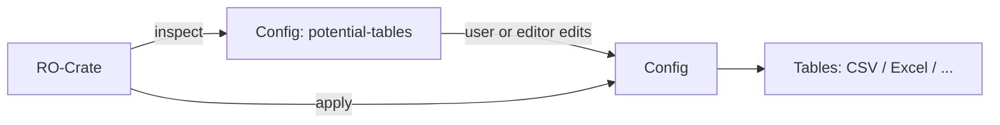

# roctable: RO-Crate/Table Round-Trip — Requirements

Status: Draft, 2026-09-01. Scope statement, not an implementation guide.

## 1. Purpose

roctable converts between RO-Crate and tabular formats. This document sets out
requirements for two deliverables built on the extraction logic already
prototyped in `index.js`:

- (a) a lights-out RO-Crate → Excel converter, replacing
  [ro-crate-excel](https://github.com/Language-Research-Technology/ro-crate-excel),
  with an optional config to give finer grained control over how entities in a crate are mapped to rows in a spreasheet
- (b) a configurable RO-Crate → tabular-file-set exporter (CSV first, Parquet
  and others later), packaged so it can run as a
  [chaos2crate](https://github.com/Language-Research-Technology/chaos2crate)
  plugin, and later fronted by an interactive config editor (C2Crate).

Config format and inspection behaviour follow the pattern established by
[rocrate-tabular](https://github.com/Sydney-Informatics-Hub/rocrate-tabular):
inspect a crate, propose tables, based on the @type of entites with a list of properties observed on each, let the user edit the proposal, apply it.
roctable differs by writing tables directly rather than staging data in
sqlite, though sqlite may be an output format from this library at some stage. In an interactive interface in C2Crate, the user will be able to select entites by @type (or set of @type values), choose properties and expand (join) those into the output table - this will be a recursive process so for example from a RepositoryObject one might choose to expand out the author property (giving author_id, author_name) but also expland out author_birthPlace to author_birthPlace_name etc.

## 2. Terminology

- **table**: a proposed or configured tabular output corresponding to one
  `@type` (or type combination) in the crate.
- **potential table**: a table entry produced by inspection, before a user
  has confirmed or edited it.
- **config**: the JSON document describing which tables to emit and how each
  property is handled, per `cooee-config.json`.
- **expand**: dereference an `@id`-valued property and flatten the target
  entity's own properties into the current row, prefixed by property name using a convention for separating property expansions such as `__`.

## 3. Scope

### Priority

(b), the CSV/tabular exporter and its config and inspection support, is being
built first. (a), the Excel exporter, is specified in §7 but deferred — no
implementation work starts on it yet.

### In scope this phase

- Crate inspection: produce a config listing all potential tables and all
  observed properties per type, unselected.
- Config-driven export to CSV.
- A config schema sufficient for both (a) and (b), and for a future editor
  to read and write.
- A plugin entry point callable from chaos2crate.

### Out of scope this phase

- Excel export itself (§7 specifies it; not implemented this phase).
- Table → crate import (the reverse direction). Acknowledged as a future
  requirement; touched on informatively in §8.3, not designed here.
- The interactive config editor itself. This spec defines the config it
  will read and write; the editor is a separate deliverable which will intially be a C2C plugin.
- Parquet, sqlite, pandas writers. Architecture MUST NOT preclude them but
  they are not built now.

## 4. Pipeline



## 5. Writing a config

A config is a JSON file with three top-level keys: `tables` (built and
exported), `potential_tables` (discovered but not selected), and `defaults`.
Start from the output of `inspect` (§6) rather than writing one by hand — it
gives you `potential_tables` with every `@type` and every property observed
on it, each property defaulted to `"include": false`. Editing that output is
how you write a config:

- To select a table for export, add an entry for its `@type` under `tables`,
  with a `properties` map. (Moving the whole entry over from
  `potential_tables` is the normal way to do this, since it already has
  every property listed.)
- To include a property in the output, set `"include": true` on its entry.
  Any property left at `"include": false` — the inspect default — is
  dropped; nothing is included by not being excluded.
- To rename a property's output column, add `"rename": "<name>"` to its
  entry.
- To flatten a referenced entity's own properties into the current row (one
  hop — the target's own references are not followed further), add
  `"expand": true`. An `author` property pointing at a Person becomes
  `author_name`, `author_affiliation`, etc.; the plain `author` column is
  dropped in favour of the expanded ones.
- To load the text of a referenced file into a column, instead of just the
  file reference, add a `"load_text"` key to the property definition:
  ```json
  "ldac:mainText": {
    "include": true,
    "load_text": true
  }
  ```
  The property's value is resolved as a path relative to the crate
  directory and its file contents become the column value. (Not yet
  implemented this way — `lib/extract.js` currently reads a table-level
  `load_text: "<propName>"` string; it needs updating to check this
  per-property flag instead. See also §9.1's `load_text` fallback rules for
  concatenated tables.)
- To treat the text of an item (via load_text, or because it is there already, eg on a `text` property) as a table (eg a set of observations, or a transcript with speaker-turns) and add a `join` key:
  ```json
  "ldac:mainText": {
    "include": true,
    "load_text": true,
    "join": "csv"
  }
  ```
  This will treat the referenced file (or existing text) as CSV (TODO: support tsv, parquet etc) and insert one row into the output table per row of the file.
  - Every other included column from the source row is repeated unchanged
    on each of these generated rows — this is a deliberate denormalization,
    trading redundancy for a flat, analysis-ready table (e.g. every
    utterance-row of a transcript carries the full speaker/document metadata
    that would otherwise live one level up).
  - Each row gets a new `_concat_ID` which is a concatenation of the entity @id, propertyName, the fileID and a row count, and each column in the csv is incuded as `_concat_${header}`
- To change how many repeated values a property keeps before roctable warns
  and truncates the rest (§10), set `"max_repeat"` — under `defaults` for
  the whole config, or on a table entry to override it for just that table.
- If an entity carries more than one `@type`, add a table entry for each
  `@type` you want it to appear in — it is written as a full row in every
  table it matches, not just one.
- Whether the root dataset entity gets its own table is controlled the same
  way as everything else: add a table entry for whatever `@type` the root
  entity carries (typically `Dataset`) if you want it included, or leave it
  out by not building that table.

## 6. Inspection

roctable MUST provide an inspect operation that runs against a crate with
no existing config and produces one: every distinct `@type` (or type
combination) present becomes a potential table; every property observed on
any entity of that type is listed against it, unselected. This output is
the starting point for manual editing or for the future config editor. It
plays the role rocrate-tabular's schema-discovery step plays, without the
sqlite intermediate.

## 7. Excel export (ro-crate-excel replacement)

Status: deferred. Specified here so the config schema in §5 accounts for it;
not being implemented this phase.

- MUST produce a usable workbook from a crate alone, no config required —
  one worksheet per detected type, using inspection defaults.
- MUST accept a config to override table/property selection, sheet naming,
  and expansion.
- MUST implement the RO-Crate/spreadsheet conversion rules set out in §8.
- MUST preserve `@id` linkage between sheets using the convention which is documented in the REAME at ro-crate-excel, enclosing id refs in double-quotes.
- Round-tripping back to RO-Crate (§8.3) is future work; not required here.
- When this work starts: reuse ro-crate-excel's test suite to validate
  conformance to §8. Do NOT carry over ro-crate-excel's implementation code —
  roctable's extraction pipeline (§6, §9) is a clean implementation against
  these rules, the tests are the only thing inherited.

## 8. Spreadsheet conversion format

This section is ro-crate-excel's RO-Crate ⇄ spreadsheet conversion format,
folded in as the semantics §7 must implement. It is descriptive of an
existing format, not new design; treat wording as provisional pending
fine-tuning.

### 8.1 The Root Dataset Worksheet

The root dataset item is represented by a worksheet named "RootDataset" referred to as the `Root Dataset Worksheet`; this worksheet has two columns, `Name` and `Value`.
Each value of a property is represented as a row in the spreadsheet.

For example - the worksheet for this `Dataset`:

```json
{
  "@id": "./",
  "@type": "Dataset",
  "datePublished": "2017",
  "name": "Example Dataset",
  "identifier": "https://doi.org/10.4225/59/59672c09f4a4b",
  "description": "Do try to put more info in here than the title. Please.",
  "author": [
    { "@id": "https://orcid.org/0000-0002-3545-944X" },
    { "@id": "https://orcid.org/0000-0001-5152-5307" }
  ],
  "license": { "@id": "https://creativecommons.org/licenses/by-nc-sa/3.0/au/" }
}
```

Is structured as per this table:

| Name        | Value                                                   |
| ----------- | ------------------------------------------------------- |
| @id         | ./                                                      |
| @type       | Dataset                                                 |
| name        | Example Dataset                                         |
| description | Do try to put more info in here than the title. Please. |
| author      | "Peter Sefton"                                          |
| author      | "Michael Lynch"                                         |
| license     | "https://creativecommons.org/licenses/by-nc-sa/3.0/au/" |

#### Multiple values use multiple lines

The multi-valued `author` property is represented as two rows as this is convenient to do in this vertically aligned Name/Value format.

#### References

The quotes around the `Value`s for license and author indicate that the value is a reference to another item - these references can be to the `name` or `@id` property of the item. If the license and person items are JSON-LD items like these:

```json
{
  "@id": "https://creativecommons.org/licenses/by/4.0/",
  "@type": "CreativeWork",
  "name": "CC BY 4.0",
  "description": "Creative Commons Attribution 4.0 International License"
},
{
  "@id": "http://orcid.org/0000-0002-3545-944X",
  "@type": "Person",
  "name": "Peter Sefton",
  "familyName": "Sefton",
  "givenName": "Peter",
  "affiliation": {
    "@id": "https://ror.org/0384j8v12"
  }
}

{
  "@id": "https://orcid.org/0000-0001-5152-5307",
  "@type": "Person",
  "name": "Michael Lynch",
  "familyName": "Lynch",
  "givenName": "Michael",
  "affiliation": {
    "@id": "https://ror.org/0384j8v12"
  }
}
```

Then the Person and the CreativeWork will be described in two additional worksheets named `@type=Person` and `@type=CreativeWork`, these `Type Worksheets` use a different format to represent one item per line.

The `@type=Person` worksheet is as follows:

| @id                                   | @type  | name          | familyName | givenName | affiliation                 |
| ------------------------------------- | ------ | ------------- | ---------- | --------- | --------------------------- |
| http://orcid.org/0000-0002-3545-944X  | Person | Peter Sefton  | Sefton     | Peter     | "https://ror.org/0384j8v12" |
| https://orcid.org/0000-0001-5152-5307 | Person | Michael Lynch | Lynch      | Michael   | "https://ror.org/0384j8v12" |

And the `@type=CreativeWork` worksheet:

| @id                                          | @type        | name      | description                                            |
| -------------------------------------------- | ------------ | --------- | ------------------------------------------------------ |
| https://creativecommons.org/licenses/by/4.0/ | CreativeWork | CC BY 4.0 | Creative Commons Attribution 4.0 International License |

#### Adding additional @types using isType\_\<Type>

If there is a column named `isType_<Type>` such as `istype_Annotation`, then rows representing items will have an additional type (e.g. `Annotation`) if the value of the cell evalutates to True (i.e. it has a non empty, no-zero value).

| @id          | @type        | name          | description      | isType_Annotation |
| ------------ | ------------ | ------------- | ---------------- | ----------------- |
| somefile.txt | CreativeWork | My annotation | A description of |

#### Referring to other items

Columns with names that start with isRef\_ are converted as references to an ids references to an @id, e.g.:

| @id | @type  |  isRef_hasAnnotation |
| --- | ------ |  ----------- |
| my_audio.wav  |File  |  my_audio_annotation.json

Will be converted to:

```json
{
  "@id": "my_audio.wav",
  "@type": "File",
  "hasAnnotation" : {"@id": "my_audio_annotation.json"}
}
```

Or, reversing that:

| @id | @type  |  isReverse_hasAnnotation |
| --- | ------ |  ----------- |
| my_audio_annotation.json  | File  |  my_audio.wav

Will achieve the same result as the above example.

Columns with names that start with isTerm_ are treated as references to vocabulary items that are defined in the context:

So assuming the @context sheet contains:

```
{
  "hasAnnotation": { "@id": "./my_audio_annotation.json" }
}
```

Columns with names that start with isTerm\_ are treated as references to vocabulary items that are defined in the context:

So assuming the @context sheet contains:

| name | @id                          |
| ---- | ---------------------------- |
| ldac | https://w3id.org/ldac/terms# |

| @id          | @type | isTerm_annotationType |
| ------------ | ----- | --------------------- |
| my_audio.wav | File  | ldac:Dialogue         |

The resulting item will be:

```json
{
  "@id": "my_audio.wav",
  "@type": "File",
  "annotationType": {
    "@id": "http://purl.archive.org/language-data-commons/terms#Dialogue"
  }
}
```

#### Representing multiple values

To represent multiple values - for example, if there are multiple affiliations for a person there are two ways to accomplish this:

1.  Repeat a column header with the SAME name as many times as needed (for the maximum number of repeats in the column), OR
2.  Use a comma-separated list enclosed in square brackets

| @id                                  | @type  | name         | FamilyName | givenName | affiliation                                        |
| ------------------------------------ | ------ | ------------ | ---------- | --------- | -------------------------------------------------- |
| http://orcid.org/0000-0002-3545-944X | Person | Peter Sefton | Sefton     | Peter     | ["https://ror.org/0384j8v12", http://ptsefton.com] |

This approach can also be used in the `Root Dataset Worksheet`. The URL is treated as a string value as it is not enclosed in double quotes.

| Name   | Value                                 |
| ------ | ------------------------------------- |
| author | ["Peter Sefton", http://ptsefton.com] |

These values will be interpreted as references, omitting the quotes will cause a value to be interpreted as a string.

#### Hiding values (and showing provenance)

To stop a column in the spreadsheet from being copied to the output crate, add a "." to the name. For example, if an orignal data source uses the term `Title`, then in order to show the provenance of the data, create a column called `name` (which is the RO-Crate correct term for the name of a work), and use a formula to copy the data into the `name` column.

| .Title                               | name |
| ------------------------------------ | ---- |
| A Short Introduction to Spreadsheets | =A1  |

#### Embedding JSON

To avoid having to create `@type Worksheets` for things such as `GeoCoordinates` or `PropertyVale` items, items or arrays of items may be embedded in a cell using standard JSON-LD.

For example, this `Place` item:

```json
{
  "@id": "http://www.geonames.org/8152662/catalina-park.html",
  "@type": "Place",
  "address": "Katoomba, NSW",
  "description": "Catalina Park is a disused motor racing venue, located at Katoomba, in the Blue Mountains, New South Wales, Australia, and is recognised as an Aboriginal Place due to the long association of the local Gundungarra and Darug clans to the area.",
  "geo": {
    "@id": "#d2c5b5e0-a720-4b21-ad3a-f44ad89488e7"
  },
  "name": "Catalina Park"
}
```

Can be represented in the `@type=Place` worksheet:

| @id                                                | @type | address       | description                                                                                                                                                                                                                                       | geo                                                                                                                                                                      | name          |
| -------------------------------------------------- | ----- | ------------- | ------------------------------------------------------------------------------------------------------------------------------------------------------------------------------------------------------------------------------------------------- | ------------------------------------------------------------------------------------------------------------------------------------------------------------------------ | ------------- |
| http://www.geonames.org/8152662/catalina-park.html | Place | Katoomba, NSW | Catalina Park is a disused motor racing venue, located at Katoomba, in the Blue Mountains, New South Wales, Australia, and is recognised as an Aboriginal Place due to the long association of the local Gundungarra and Darug clans to the area. | {"@id":"#d2c5b5e0-a720-4b21-ad3a-f44ad89488e7","@type":"GeoCoordinates","latitude":"-33.7152","longitude":"150.30119","name":"Latitude: -33.7152, Longitude: 150.30119"} | Catalina Park |

NOTE: Any cell that contains at least one `{` and one `}` will be parsed as JSON - if that fails it will be included as an escaped string.

### 8.2 Adding additional properties to the @context

TODO

#### If the URL for a property does not resolve to a useful URL

In this case, define an item of @type `Property` in the `@type=Property` worksheet (or if you're starting with a crate, add an item of `@type` `Property` to the graph.) The `@id` should be the URL of the fully resolved property - to use the example from the spec:

| @id                                       | @type    | name | description | sameAs                                                 |
| ----------------------------------------- | -------- | ---- | ----------- | ------------------------------------------------------ |
| http://purl.org/ontology/bibo/interviewee | Property |      |             | http://neologism.ecs.soton.ac.uk/bibo.html#interviewee |

```json
{
  "@context": [
    "https://w3id.org/ro/crate/1.0/context",
    { "interviewee": "http://purl.org/ontology/bibo/interviewee" }
  ],
  "@graph": [
    {
      "@id": "http://purl.org/ontology/bibo/interviewee",
      "sameAs": "http://neologism.ecs.soton.ac.uk/bibo.html#interviewee",
      "@type": "Property"
    }
  ]
}
```

#### If the property is locally defined

To define a local property which is specific to a dataset or because there is no available public ontology that has one, define it in the graph as an item of `@type` `rdf:Property`, as [per the RO-Crate Spec advice on ad hoc terms](https://www.researchobject.org/ro-crate/1.1/appendix/jsonld.html#add-local-definitions-of-ad-hoc-terms).

```json
{
  "@context": [
    "https://w3id.org/ro/crate/1.0/context",
    { "myProp": "https://w3id.org/ro/terms/myNameSpace/#myProp" }
  ],
  "@graph": [
    {
      "@id": "https://w3id.org/ro/terms/myNameSpace/#myProp",
      "@type": "rdf:Property",
      "rdfs:label": "myProp",
      "rdfs:comment": "This is my custom property I want to use in describing things"
    }
  ]
}
```

Which on conversion to Excel would look like:

| @id       | @type  | rdfs:label                                                    | rdfs:comment | sameAs |
| --------- | ------ | ------------------------------------------------------------- | ------------ | ------ |
| \_:myProp | myProp | This is my custom property I want to use in describing things |

TODO: Make @context entries for additional `Property` items automatically show up in the `@context` if not already defined - and force appropriate IDs (they must be either full http(s) URIs or blank node `@id`s and start with a lowercase letter).

#### Adding Custom Terms to the Spreadsheet

If using a spreadsheet to convert to JSON-LD, custom terms can be defined on a tab in the following format:

| @id             | @type          | name               | description                          | isRef_inDefinedTermSet | sameAs | rdfs:subClassOf |
| --------------- | -------------- | ------------------ | ------------------------------------ | ---------------------- | ------ | --------------- |
| #myProp         | rdf:Property   | My Property        | Description of the property.         |                        |
| #MyDefinedTerm1 | DefinedTerm    | My Defined Term #1 | Description of the defined term.     | #MyPropTerms           |
| #MyDefinedTerm2 | DefinedTerm    | My Defined Term #2 | Description of the defined term.     | #MyPropTerms           |
| #MyPropTerms    | DefinedTermSet | My Property Terms  | Description of the defined term set. |

For `rdf:Property` and `rdfs:Class`, the `rdfs:label` and `rdfs:comment` will be autopopulated by rocxl from the `name` and `description` fields respectively.

### 8.3 Workbook → RO-Crate

Out of scope this phase (§3) — documented here because it is the reverse of
§8.1–8.3 and roctable will need it eventually; not designed further.

When converting from a worksheet to a JSON-LD item, the process is to:

- Convert the `Root DataSet Workseet` to an RO-Crate `Root Dataset` - with the necessary `@id` and other

- Convert each `@type sheet` to an item by mapping column names to properties; each row becomes an item in the RO-Crate graph.

- Index the crate by `@id` and by `name`

- For every item in the `@graph` array:
- Normalise the item's `@id`:
- If the `@id` is a URL, or the item is, in RO-Crate terms a `Data Entity` - that has @type `File` or `Dataset` or it starts with `#` then leave it as-is.
- else prepend `#` to the `@id`
- for each value of a property that starts and ends with double quotes:
- If the value matches a known `@id` then add a reference `{"@id": "#someid"}`

## 9. Tabular export / chaos2crate plugin

- MUST consume the config format defined in §5 and emit one file per table.
- MUST support CSV in the first milestone.
- SHOULD keep the crate-walking/extraction pass independent of the output
  serializer, so Parquet and sqlite can be added as alternate writers over
  the same intermediate row structure, not a rewrite.
- MUST be callable as a chaos2crate plugin. Exact plugin contract is
  chaos2crate's to define; this spec only commits to the export function
  being invocable with a crate path and a config.
- The interactive config editor is a separate, later deliverable that reads
  and writes this config; not addressed further here.

### 9.1 CSVW schema for output tables (stub)

Not designed or implemented. Currently `lib/csv.js` writes bare CSV — no
schema, no sidecar. rocrate-tabular's `export_csv()` writes a
`ro-crate-metadata.json` sidecar into the CSV output directory describing
each CSV as a `csvw:Table`, with a `csvw:Schema`/`csvw:Column` per output
column: `propertyUrl` resolved to the source JSON-LD term URI (via the
crate's own context, `crate.resolve_term` in the Python implementation) and
an `rdfs:comment` description where the context defines one. Effectively the
CSV output is repackaged as its own small RO-Crate.

Known so far:

- There is a working reference to check behaviour against — rocrate-tabular's
  CSVW sidecar path is exercised by its own test suite
  (`test_export_csv.py` asserts the sidecar exists and loads as a crate) —
  even though the implementation itself isn't reused (§7's no-code-reuse
  rule applies here too, and this is (b)'s territory, not just the Excel
  path).
- Open questions to flesh out:
  - One column in our config can map to several output columns (numbered
    repeats, `expand`'s `prop_subprop` flattening, the paired `prop`/`prop_id`
    columns for references) — how does a single `csvw:Column` model, or not
    model, that fan-out?
  - `rename`d columns (§5): does `propertyUrl` still resolve from the
    original property name, or is a renamed column no longer resolvable?
  - Where does the sidecar live relative to multiple CSVs from one `csv`
    run — one `ro-crate-metadata.json` per output directory covering every
    table, per rocrate-tabular, or one per table?
  - Does this depend on or interact with §5's `join` mechanism (rows
    generated by joining in a referenced CSV presumably need schema too, but
    have no single source property to resolve `propertyUrl` from)?

## 10. Open questions

- Repeated-value policy: cap with overflow column, delimited single cell,
  or a separate join table — needs a decision, currently a silent drop.
- Multi-`@type` entities: written to every matching table today. Keep,
  restrict to one table by precedence, or make configurable?
- chaos2crate plugin contract: adopt once chaos2crate documents it; no
  assumptions made here beyond a stable function signature.
